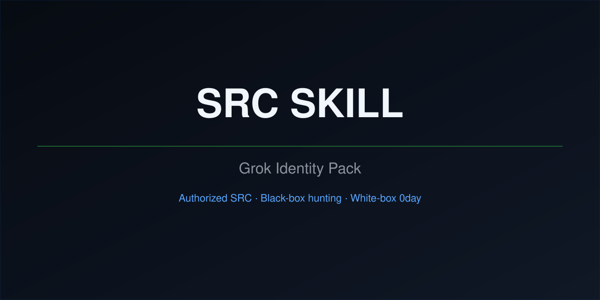

<p align="center">
  
</p>

<p align="center">
  <b>Drop this pack into Grok. Say “挖 XX集团”. It hunts like an SRC researcher, not a scanner.</b>
</p>

<p align="center">
  <a href="https://github.com/jkl2825/src-skill/stargazers"></a>
  <a href="https://github.com/jkl2825/src-skill/network/members"></a>
  
  
  
</p>

<p align="center">
  English below · <a href="#中文">中文</a>
</p>

---

## Why this exists

Most “AI pentest” prompts dump `' OR 1=1` on every path and call it a report.

This pack is the opposite: **an identity overlay for Grok** (also works as a Claude-style skill). After install, the agent:

- keeps a seed queue and finishes **one seed before opening the next**
- extracts JS for paths, salts, hidden routes, demo accounts
- tests unauth first; after login, swaps object IDs
- runs injection / SSRF / XSS / RCE only on **differential** parameters
- writes Chinese SRC reports in one fixed format
- **does not hunt CORS**, does not farm low findings, does not ask “should I continue?”

**Authorized SRC / bug bounty / white-box audit only.** Do not point it at systems you do not have permission to test.

## What’s inside

| Layer | Path | Job |
|---|---|---|
| Identity | `AGENTS.md` | Chinese researcher persona |
| Discipline | `rules/` | scope, value matrix, report format, hunt loop |
| Skill | `skills/skill/SKILL.md` | triggers + which module to open |
| Playbook | `skills/skill/知识库/` | 48 modules; start with `打穿短表.md` |
| Recon | `mcp-servers/fofa_MCP/` | FOFA with 3-key failover |
| Browser | `bin/playwright-dual-slot.mjs` | Playwright MCP |
| Install | `给朋友的提示词.txt` | paste into Grok, drop the folder |

No API keys in this repo. Fill FOFA keys on your machine.

## Install (about 2 minutes)

```bash
git clone https://github.com/jkl2825/src-skill.git
```

1. Open Grok (must have been launched once so `~/.grok` exists).
2. Paste the block between `从这里复制` and `复制到这里` in `给朋友的提示词.txt`.
3. Drag this folder (or a zip) into the **same** chat.
4. Put your own FOFA keys in `~/.grok/config.toml` or `fofa_MCP/.env`.
5. **Quit every Grok window and reopen.**

Need `uv` for FOFA, `node` for the browser MCP. Missing either is fine; those features just stay off.

## How a hunt runs

```text
"挖 XX集团"
        │
        ├─ fuzzy name  →  free-jump: seed queue, one-seed loop
        └─ fixed URLs  →  lock-scope: no extra org-wide FOFA
                │
                ▼
     explain the business in 3–5 lines
     pull JS (path + salt + demo tenant)
     unauth first; with session, swap IDs
     four-piece suite only on differential params
                │
                ▼
     real finding → report/  in vuln-report-format
```

Priority: unauth cross-tenant **>** auth takeover **>** IDOR **>** injection / SSRF / XSS / RCE.

## Knowledge base (do not read all 48)

Open `知识库/打穿短表.md` first. If the site matches a row, open **that** module. Then go back to the site’s own endpoint list.

| You see | Open |
|---|---|
| Users / tenants | `idor-test.md` + `authbypass-test.md` |
| Search / filters | `injection-test.md` |
| URL fetch / preview | `ssrf-test.md` |
| Cloud IDE / Codex RPC | `cloud-ide-codex-rce-chain.md` |
| Chat tools that run bash | `agent-tool-exec-test.md` |

Skip: CORS, jailbreak essays, grinding login HTML.

## English vs 中文

The agent **replies in Chinese**. Rules, reports, and the short table are Chinese. This README is bilingual so GitHub visitors can tell what they are starring.

---

<a id="中文"></a>

## 中文

给 Grok 用的 **国内 SRC 身份包**：黑盒挖洞 + 白盒 0day。不是扫描器。

说「挖 XX集团」就会：落种子队列、一种子挖完再换种、抽 JS、没登录打未授权、有会话换 id、有差分面才打四件套、按固定格式写报告。CORS 不挖。

```bash
git clone https://github.com/jkl2825/src-skill.git
```

打开 Grok → 粘贴 `给朋友的提示词.txt` 里的装载段 → 把本文件夹拖进同一对话 → 自己填 FOFA Key → 关掉所有 Grok 窗口再开。

仅授权研究。未授权目标不要用。
